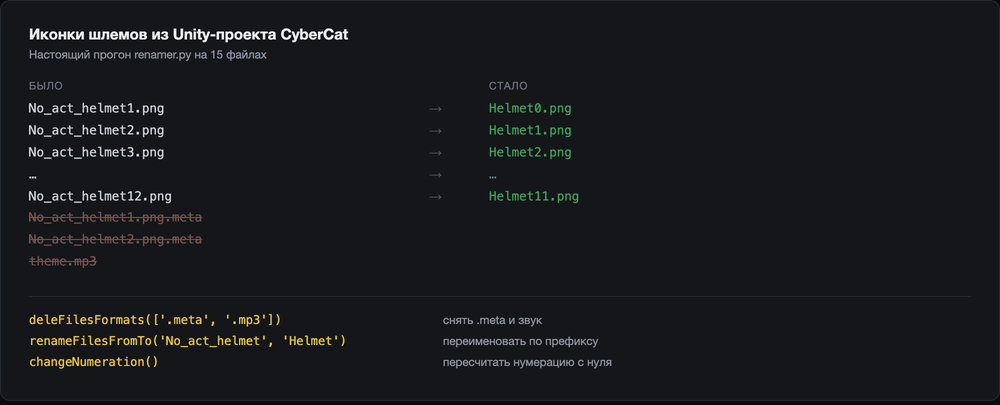

# Sprite Renamer

*[English version](README.md)*

Небольшой Python-скрипт для скучной половины интеграции арта в Unity: массово переименовать папку
спрайтов, убрать сопутствующий мусор и пересчитать нумерацию с 1..n на 0..n−1, чтобы имена файлов
сходились с индексами массива, в который игра их читает.

Написан в 2020-м во время работы над **CyberCat** — мобильной игрой небольшой студии.

---

## Проблема

Арт приходит от художника названным так, как назвал художник. Игре он нужен названным так, как его
читает код. Между этими двумя фактами лежит работа, которой никто никогда не радовался.

- **Пачка — это пачка.** Комплект шлема — двенадцать иконок, и комплектов много. Переименовать
  двенадцать файлов руками — пять минут; делать это на каждый комплект при каждой передаче арта —
  остаток дня.
- **Нумерация смещена на единицу, и это не случайность.** Художники считают с единицы, потому что
  люди считают с единицы. Код индексирует с нуля. Переименовать `helmet1..helmet12` в
  `helmet0..helmet11` руками — значит идти по списку в правильном порядке или затереть файл, который
  уже существует.
- **Unity оставляет мусор.** У каждого ассета есть `.meta`-спутник. Перенеси или скопируй папку не
  тем способом — и останутся осиротевшие `.meta`, которые Unity, конечно, пересоздаст, но до тех пор
  они будут засорять диф.
- **Ручное переименование ошибается молча.** Пропустишь один файл из двенадцати — ничего не сломается,
  просто в игре не будет иконки. Один раз, у одного шлема, и узнаешь ты об этом в сборке.

## Решение

Пять функций поверх `os.listdir` и `os.rename`, каждая делает одно преобразование, целевая папка —
переменная в начале файла:

- `renameFilesFromTo(from, to)` — заменить префикс имени по всей папке
- `changeNumeration()` — сдвинуть хвостовой номер на единицу вниз, в два прохода с промежуточным
  префиксом `___`, чтобы переименование никогда не приземлялось на ещё существующее имя
- `addStringToFronName(str)` — приписать строку в начало каждого имени
- `addFormat(ext)` — вернуть расширение файлам, которые его потеряли
- `deleFilesFormats()` — удалить спутников

Двухпроходная нумерация — единственное неочевидное место здесь, и оно же главное: переименование
`1→0, 2→1, 3→2` на месте сталкивается на каждом шаге, поэтому скрипт сначала переименовывает всё во
временные имена с префиксом `___`, а вторым проходом префикс снимает.

Вызовы лежат закомментированными в конце файла — раскомментируешь нужный и запускаешь. Это
инструмент на одного человека, и выглядит он ровно как инструмент на одного человека.

---

## Как это выглядит

Настоящий прогон на папке иконок шлемов — той же формы, что и в CyberCat:



---

## Как запустить

```bash
git clone https://github.com/ZergMaster/pythonRenamer.git && cd pythonRenamer
# 1. пропиши свою папку спрайтов в `path` в начале renamer.py
# 2. раскомментируй нужный вызов в конце файла
python3 renamer.py
```

Переименовывает на месте, без сухого прогона и без отмены, — так что в первый раз наводи на копию.

**Две шероховатости, которые лучше назвать, чем спрятать:** `deleFilesFormats()` игнорирует свой
аргумент и всегда удаляет `.meta` и `.mp3` — параметр так и не подключили. А `addStringToFronName()`
при переименовании теряет расширение, поэтому полезен только на файлах без расширения или в паре с
`addFormat()`.

---

## Кто пользовался и что это дало

Я и пользовался, на Unity-проекте CyberCat — зашитый в файле путь до сих пор смотрит в
`Assets/Resources/Sprites/ui/Helmet/Icons/big`. Он заменил ручное переименование пачек спрайтов в
проводнике, и больше его никто никогда не запускал.

Кладу его сюда не вопреки тому, что он такой, а именно поэтому. Это самая маленькая версия того, что
я с тех пор построил четыре раза в трёх студиях, и каждый из тех разов начинался ровно отсюда: с
того, что шаг между художником и сборкой делается руками, и с тридцати строк, чтобы перестать его
делать. Те, что оказались важными, выросли в тул извлечения вёрстки, автоматическую доставку арта,
диффер рескинов и редактор LiveOps-контента, — но рефлекс один и тот же, и этот файл самый ранний
честный его пример из уцелевших.

---

## Стек

Python 3 · только стандартная библиотека (`os`)
